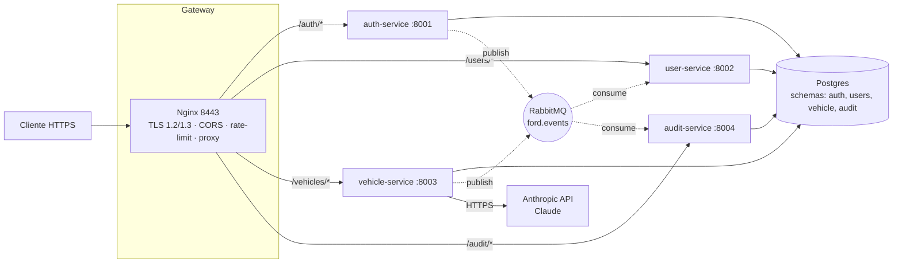

# Ford Challenge — SOA + Cybersecurity API

Backend modular para o desafio Ford, organizado como 4 microsserviços em Python que recebem `marca + modelo + versão + atributos` e retornam uma lista padronizada de especificações técnicas. A fonte de dados é a API do Claude (Anthropic).

O projeto cobre todos os critérios da Sprint **SOA + Web Services (100 pts)** e **Cybersecurity (60 pts)**.

## Integrantes

| Nome | RM |
|------|----|
| Felipe Cerboncini Cordeiro | 554909 |
| Pedro Henrique Martins Alves dos Santos | 558107 |
| Milena Codinhoto da Silva | 554682 |
| Anthony K. Motobe | 558488 |
| Evellyn Valencia | 557929 |

---

## 1. Arquitetura



### Camadas internas (por serviço)

Cada serviço segue o padrão `controller → service → repository → model`:

```
src/<service>/
├── main.py            # FastAPI app + lifespan (DB, MQ, JWT, Claude)
├── config.py          # pydantic-settings (envs)
├── controllers/       # HTTP/REST + Swagger metadata
├── services/          # casos de uso (regra de negócio)
├── repositories/      # acesso a dados (SQLAlchemy async)
├── models/            # ORM
├── schemas/           # Pydantic DTO entrada/saída
└── events/            # publishers + consumers
```

Utilitários compartilhados em `packages/shared/src/ford_shared/` (JWT, bcrypt, HMAC, EventBus, middleware de erro/segurança, base SQLAlchemy).

---

## 2. Serviços

| Serviço | Porta | Schema | Responsabilidade |
|---|---|---|---|
| **auth-service** | 8001 | `auth` | Registro, login, refresh, emissão de JWT (HS256, exp 15min, refresh rotativo) |
| **user-service** | 8002 | `users` | Perfis. Consome `user.registered` para criar profile. Suporta `GET /users/me`, listagem (analyst+), promoção de papel (admin) |
| **vehicle-service** | 8003 | `vehicle` | Recebe consulta `(brand, model, version, attributes[])`, chama Claude (tool-call para JSON), normaliza specs e persiste |
| **audit-service** | 8004 | `audit` | Consumer wildcard (`#`) — persiste TODOS os eventos com assinatura. `GET /audit/events` (admin) |

Infra: **Postgres 16**, **RabbitMQ 3** (topic exchange `ford.events`), **Redis 7** (rate limit slowapi), **Nginx 1.27** (TLS, rate-limit, CORS, reverse proxy).

---

## 3. Setup

### Requisitos

- Docker + Docker Compose
- `uv` para dev local (opcional): `curl -LsSf https://astral.sh/uv/install.sh | sh`
- Chave da Anthropic ([console.anthropic.com](https://console.anthropic.com))

### Subir tudo

```bash
cp .env.example .env
# Edite .env e defina ANTHROPIC_API_KEY + ajuste JWT_SECRET e EVENT_SIGNING_SECRET
# Gere segredos com: openssl rand -hex 32

docker compose up --build
```

Quando todos os healthchecks ficarem verdes:

- API gateway: `https://localhost:8443`
- Swagger por serviço:
  - `https://localhost:8443/auth/docs`
  - `https://localhost:8443/users/docs`
  - `https://localhost:8443/vehicles/docs`
  - `https://localhost:8443/audit/docs`
- RabbitMQ UI: `http://localhost:15672` (login do `.env`)
- Postgres: `localhost:5432`

> O certificado é self-signed; use `-k` no `curl` ou aceite o aviso no navegador.

---

## 4. Fluxo End-to-End

### 4.1 Registrar usuário

```bash
curl -k -X POST https://localhost:8443/auth/register \
  -H "Content-Type: application/json" \
  -d '{
    "email": "felipe@ford.com",
    "password": "Strong#Pass123!",
    "full_name": "Felipe Cerboncini"
  }'
```

### 4.2 Login (obtém JWT)

```bash
TOKEN=$(curl -ks -X POST https://localhost:8443/auth/login \
  -H "Content-Type: application/json" \
  -d '{"email":"felipe@ford.com","password":"Strong#Pass123!"}' \
  | jq -r .access_token)
echo "$TOKEN"
```

### 4.3 Consultar Ford Ranger Raptor

```bash
curl -k -X POST https://localhost:8443/vehicles/query \
  -H "Authorization: Bearer $TOKEN" \
  -H "Content-Type: application/json" \
  -d '{
    "brand": "Ford",
    "model": "Ranger Raptor",
    "version": "2024",
    "attributes": [
      "motor",
      "potencia",
      "torque maximo",
      "transmissao",
      "tracao",
      "amortecedores",
      "0-100 km/h",
      "modos de conducao",
      "modos de volante",
      "modos de escapamento",
      "modos de amortecedor",
      "farois",
      "rodas e pneus",
      "preco"
    ]
  }'
```

A resposta sempre traz uma entrada por atributo solicitado, com `value`, `available`, `normalized_unit` e `source_hint`. Atributos não encontrados vêm com `{"value": null, "available": false}`.

### 4.4 Inspecionar trilha de auditoria (admin)

Após promover um usuário a admin (via SQL ou outro admin), liste eventos:

```bash
curl -k https://localhost:8443/audit/events \
  -H "Authorization: Bearer $ADMIN_TOKEN" | jq
```

---

## 5. Mapa Cybersecurity → Implementação

| Requisito do rubric | Onde mora |
|---|---|
| **SQL injection** | Toda a persistência via SQLAlchemy parametrizado (`select(...)`, ORM). Zero raw SQL no path de request |
| **XSS** | Respostas exclusivamente JSON; `X-Content-Type-Options: nosniff`, `CSP default-src 'none'` aplicados em todo response (middleware `SecurityHeadersMiddleware`) |
| **Command injection** | Nenhum uso de `subprocess`/`os.system` nos paths de request; entradas são validadas por Pydantic antes de qualquer uso |
| **Validação de entrada** | Pydantic com `pattern`, `max_length`, `min_items/max_items` em todos os schemas (`RegisterRequest`, `QueryRequest` etc) |
| **Limite de tamanho** | `client_max_body_size 64k` no Nginx + `max_length` em cada campo |
| **Erros seguros** | `register_exception_handlers` retorna `{error: {code, message, request_id}}`; nunca expõe stack trace nem traceback. Detalhe vai pro log com correlação por `request_id` |
| **JWT** | `python-jose` HS256, exp 15min, refresh 7d rotativo com revogação em `auth.refresh_tokens` |
| **RBAC** | Enum `Role(user|analyst|admin)` + dependency `require_role(Role.X)`; hierarquia validada por `role_at_least` |
| **HTTPS/TLS 1.2+** | Nginx `ssl_protocols TLSv1.2 TLSv1.3`, ciphers ECDHE/AES-GCM, HSTS habilitado |
| **Rate limiting** | Nginx `limit_req_zone` global + zone específica `auth_login` (5r/min) + `slowapi` por endpoint (`/auth/login` 5/min, `/auth/register` 10/min, `/vehicles/query` 20/min) |
| **CORS** | `CORSMiddleware` com whitelist configurável (`CORS_ALLOWED_ORIGINS`); headers e métodos limitados a `Authorization`, `Content-Type`, `X-Request-ID`, `X-Signature` |
| **Integridade de payload** | Toda mensagem no event bus carrega header `x-signature` HMAC-SHA256; o consumer rejeita silenciosamente eventos com assinatura inválida (`EventBus._dispatch`) |

---

## 6. Padrões REST / SOA

- **Métodos HTTP** respeitam semântica: `POST` para criação/login/query, `GET` para leitura, `PATCH` para update parcial, `PUT` para update completo (role change)
- **Status codes** padronizados: 201 (created), 200 (ok), 401 (unauthorized), 403 (forbidden), 404 (not found), 409 (conflict), 422 (validation), 429 (rate limit), 502 (upstream Claude)
- **Documentação OpenAPI/Swagger** auto-gerada por serviço em `/<service>/docs`
- **Separação clara** de camadas (presentation/service/data) — repositórios nunca aparecem em controllers, controllers nunca acessam ORM diretamente
- **Independência** — cada serviço pode subir, fazer build e ser deployado isolado; comunicação assíncrona via eventos (não há acoplamento síncrono service-to-service)

---

## 7. Banco de dados & Migrations

- 1 instância Postgres com **4 schemas** (`auth`, `users`, `vehicle`, `audit`)
- Cada serviço tem seu **próprio Alembic** com `version_table_schema` apontando para seu schema → nenhum serviço pode aplicar migration fora do seu domínio
- `entrypoint.sh` de cada serviço executa `alembic upgrade head` antes de subir o uvicorn
- Migration inicial cria schema + extensions necessárias (`uuid-ossp`, `citext`)

---

## 8. Event Bus (RabbitMQ)

- Exchange: `ford.events` tipo `topic`, durable
- Eventos publicados:
  - `user.registered` (auth-service → user-service, audit-service)
  - `user.logged_in` (auth-service → audit-service)
  - `auth.failed` (auth-service → audit-service)
  - `vehicle.query.requested` (vehicle-service → audit-service)
  - `vehicle.query.completed` (vehicle-service → audit-service)
- Cada serviço declara sua fila com routing keys específicas; **audit-service** usa `#` (wildcard) para receber tudo
- Mensagens são **assinadas com HMAC-SHA256** (header `x-signature`) e verificadas no consumer — mensagem adulterada é rejeitada

---

## 9. Estrutura do projeto

```
Ford-api/
├── pyproject.toml              # uv workspace root
├── docker-compose.yml          # postgres + rabbitmq + redis + nginx + 4 services
├── .env.example                # template das variáveis de ambiente
├── README.md                   # este arquivo
├── infra/
│   ├── nginx/                  # Dockerfile + nginx.conf (TLS, rate-limit, CORS)
│   └── postgres/init.sql       # cria schemas e extensions
├── packages/
│   └── shared/                 # ford_shared (uv workspace member)
│       └── src/ford_shared/
│           ├── app.py          # apply_standard_middleware()
│           ├── config.py       # BaseServiceSettings
│           ├── db/             # Database (async) + Base
│           ├── events/         # EventBus + schemas
│           ├── middleware/     # error_handler, request_id, security_headers
│           └── security/       # jwt, passwords, signature, rbac, dependencies
└── services/
    ├── auth-service/
    ├── user-service/
    ├── vehicle-service/
    └── audit-service/
```

---

## 10. Validação do desafio (Ford Ranger Raptor)

O slide de validação lista 14 especificações da Ranger Raptor:

1. Motor: V6 3.0L Nano bi turbo
2. Potência: 397cv @ 5650 RPM
3. Torque máximo: 583 Nm @ 3500 RPM
4. Transmissão: AT de 10 velocidades e paddle shifters
5. Tração: 4WD
6. Amortecedores: Live Valve FOX Racing 2.5"
7. 0-100 km/h: 5,8s
8. Modos de condução: Normal, Sport, Escorregadio, Lama, Areia, Rock Crawl, Baja
9. Modos de volante: Normal, Sport, Comforto
10. Modos de escapamento: Normal, Silencioso, Sport, Baja
11. Modos de amortecedor: Normal, Sport, Baja
12. Faróis: Matrix LED
13. Rodas e pneus: 17" com 285/70 R17 AT
14. Preço: R$499.000

Para validar, basta:

```bash
docker compose up --build -d
# subir todos serviços, aguardar healthchecks ficarem verdes (≈30s)

curl -k -X POST https://localhost:8443/auth/register -H "Content-Type: application/json" \
  -d '{"email":"raptor@ford.com","password":"Raptor#Test123!","full_name":"Tester"}'

TOKEN=$(curl -ks -X POST https://localhost:8443/auth/login \
  -H "Content-Type: application/json" \
  -d '{"email":"raptor@ford.com","password":"Raptor#Test123!"}' | jq -r .access_token)

curl -k -X POST https://localhost:8443/vehicles/query \
  -H "Authorization: Bearer $TOKEN" \
  -H "Content-Type: application/json" \
  -d @scripts/ranger-raptor.json | jq
```

(Arquivo `scripts/ranger-raptor.json` com a lista completa de atributos está em `scripts/`.)

A resposta deve trazer todas as 14 specs com valores correspondentes ao slide.

---

## 11. Roadmap de testes manuais

| Caso | Como reproduzir | Esperado |
|---|---|---|
| Senha fraca | `POST /auth/register` com `password: "12345"` | 422 com mensagem de validação |
| Email duplicado | Registrar 2x com o mesmo email | 2ª retorna 409 |
| Sem token | `POST /vehicles/query` sem header | 401 |
| Rate limit login | 6 logins em <1min | 429 a partir da 6ª |
| Body grande | `POST` com body > 64KB | 413 (Nginx) |
| SQL injection | `email: "x' OR '1'='1"` no login | 422 (regex) ou 401 (não autenticado) — **nunca** sucesso |
| Privilege escalation | user comum chama `PUT /users/{id}/role` | 403 |
| Stack trace leak | Forçar 500 | Mensagem genérica + `request_id`, sem traceback |

---

## 12. Dev local (sem Docker)

```bash
uv sync
# auth-service
uv run --package auth-service alembic -c services/auth-service/alembic.ini upgrade head
uv run --package auth-service uvicorn auth_service.main:app --reload --port 8001
```

Repita o padrão para os outros serviços. Postgres/RabbitMQ podem rodar via `docker compose up postgres rabbitmq redis`.

---

## 13. Tecnologias

| Camada | Lib / Versão |
|---|---|
| Runtime | Python 3.12 |
| Package manager | uv (workspaces) |
| Framework HTTP | FastAPI 0.111 |
| ORM | SQLAlchemy 2.0 async |
| Migrations | Alembic 1.13 |
| DB driver | asyncpg 0.29 |
| MQ | aio-pika 9.4 (RabbitMQ 3.13) |
| Validação | Pydantic v2 + pydantic-settings |
| AuthN | python-jose (JWT HS256) + passlib[bcrypt] |
| Rate limit | slowapi (Redis backend) + Nginx `limit_req_zone` |
| AI | Anthropic SDK 0.34 (Claude) + tenacity (retry) |
| Reverse proxy / TLS | Nginx 1.27-alpine |
